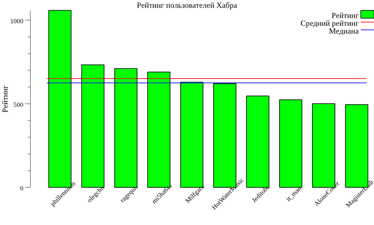
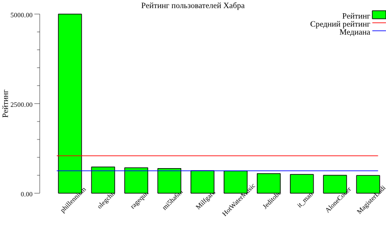

# Введение в анализ данных с помощью Go

Статья носит познавательно-развлекательный характер, код лучше не использовать в проде.
ЦЯ решил её написать, во-первых, потому что так и не нашёл аналогичных русскоязычных материалов, а во-вторых
-- потому что мне нравится Go и аналитика. Такие дела.

Что подразумевается под анализом данных в этой статье?
Прежде всего поиск закономерностей и соотношений в числовых наборах данных.
Например, нахождение зависимости между временем публикации поста в блоге и числом просмотров.
Или процент нецензурных слов в твите и количество его ретвитов.

## Базовые компоненты

Основные сущности, с которыми мы будем работать -- это вектор и матрица. Для Go существуют несколько быстрых библиотек линейной алгебры (TODO: вставить примеры). Мы же будем изобретать свой велосипед из педагогических соображений.

> Вектор -- это упорядоченный набор чисел. Основными операциями над вектором являются сложение с другим вектором, умножение на вектор и на число, вычисление нормы.

Определим кастомынй тип вектора. Такой подход с созданием типа-псевдонима позволит нам использовать цепочки вызовов методов вместо глубоко вложенных вызовов функций.

```go
type Vector []float64
```

Для начал напишем базовые утилиты, они сильно упростят нам жизнь в будущем MakeVec, Len, New и Copy:

TODO: добавить спойлер

```go

// Удобная функция для конструирования векторов из других коллекций
func MakeVec(len int, source func(i int) float64) Vector {
	var vector = make(Vector, 0, len)
	for i := 0; i < len; i++ {
		vector = append(vector, source(i))
	}
	return vector
}

// Опять же, дело вкуса, но мне удобнее использовать вызов метода чем функциию
func (vector Vector) Len() int {
	return len(vector)
}

// Фабрика, возвращающая преаллоцированный вектор с ёмкостью равной длине оригинального вектора.
// TODO: добавить ссылку на страницу документации по слайсам
func (vector Vector) New() Vector {
	return make(Vector, 0, len(vector))
}

// Копирование вектора, очевидно
func (vector Vector) Copy() Vector {
	return append(vector.New(), vector...)
}

// Применение функции на весь вектор
func (vector Vector) Map(op func(x float64) float64) Vector {
	var result = vector.New()
	for _, x := range vector {
		result = append(result, op(x))
	}
	return result
}
```

Фух, теперь займёмся непосредственно математикой. Замечу, что сейчас дальше будет реализация операций не самым эффективным, но довольно наглядным способом:

TODO: добавить спойлер

Сложение двух векторов

```go
func (vector Vector) AddVector(xx Vector) Vector {
	if vector.Len() != xx.Len() {
		panic("[Vector.AddVector] expects vectors with equal lengths")
	}
	var result = vector.Copy()
	for i, x := range xx {
		result[i] += x
	}
	return result
}
```

Пребавить число к каждому элементу вектора

```go
func (vector Vector) AddScalar(k float64) Vector {
	var result = vector.Copy()
	for i := range vector {
		result[i] += k
	}
	return result
}
```

Поэлементное умножение двух векторов

```go
func (vector Vector) MulVector(xx Vector) Vector {
	if vector.Len() != xx.Len() {
		panic("[Vector.MulVector] expects vectors with equal lengths")
	}
	var result = vector.Copy()
	for i, x := range xx {
		result[i] *= x
	}
	return result
}
```

Поэлементное умножение вектора на число

```go
func (vector Vector) MulScalar(k float64) Vector {
	var result = vector.Copy()
	for i := range vector {
		result[i] *= k
	}
	return result
}
```

Скалярное произведение двух векторов

```go
func (vector Vector) MulDot(another Vector) float64 {
	if vector.Len() != another.Len() {
		panic("[Vector.MulDot] expect vectors with equal lengths")
	}
	var result float64
	for i, x := range another {
		result += vector[i] * x
	}
	return result
}
```

Нхождение суммы всех элементов вектора

```go
func (vector Vector) Sum() float64 {
	var accum float64
	for _, x := range vector {
		accum += x
	}
	return accum
}
```

Теперь когда у нас есть минимальный набор инструментов векторной алгебры, можно
перейти непосредственно с анализу данных.

Когда нам нужно описать набор измерений, первое что приходит в голову --
получить какие-то характерные величины. Посмотрев на эти величины,
мы уже сможем понять какие-то простые вещи о нашем массиве чисел.

### Среднее

Самый простой способ как-то описать набор чисел -- это посчитать их среднее.
Среднее -- это сумма элементов вектора, делённая на их количество.
Реализовать этот метод просто:

```go
func (vector Vector) Mean() float64 {
    	return vector.Sum() / float64(vector.Len())
}
```

Возьмём какой-нибудь набор данных, например -- рейтинги топ10 пользователей Хабра
(07.08.2018).

|Пользователь|Рейтинг|
|------------|-------|
|phillennium|1058.6|
|olegchir|733.0|
|ragequit|710.7|
|mi5ha6in| 689.9|
|Milfgard| 629.2| 
|HotWaterMusic|620.9|
|Jeditobe|546.9|
|it_man|524.3|
|AloneCoder|500.9|
|MagisterLudi|495.4|

```go
	var raitings = Vector{
		1058.6,
		733.0,
		710.7,
		689.9,
		629.2,
		620.9,
		546.9,
		524.3,
		500.9,
		495.4,
	}
	fmt.Println(raitings.Mean())
	// -> 650.9799999999999
```

Похоже на правду :3


Среднее неплохо описывает наборы значений, элементы которых мало отличаются друг
от друга. Любой сильный выборс может сильно исказить повлиять на значение среднего.

Смоделируем ситуацию, при которой один из пользователей накрутил рейтинг.
В качестве такого значения возьмём 2000. Посчитаем новое значение среднего:

```go
var raitings = Vector{
		5000,
		733.0,
		710.7,
		689.9,
		629.2,
		620.9,
		546.9,
		524.3,
		500.9,
		495.4,
	}
	var mean = raitings.Mean()
	fmt.Println(raitings.Mean())
	// -> 745.1
```


Видно, что полученное значение плохо характеризует весь набор данных:  
большая все значения от него сильно отклоняются,
причём направления отклонения распределены сильно несимметрично.
Как в поговорке: ты ешь мясо, я ем капусту, а в среднем мы едим голубцы.

### Медиана

Введём новую характеристику для набора данных -- медиану.
Медиана -- это ближайшее к центру значение в отсортированном списке элементов
в случае если их количество нечётное или среднее от двух самых ближайших к центру
значенией, если их число чётное.

Для начала сделаем метод сортировки элементов нашего вектора, для чего
воспользуемся библиотечной функцией sort.Float64s

```go
func (vector Vector) Sorted() Vector {
	var sorted = vector.Copy()
	sort.Float64s(sorted)
	return sorted
}
```

И реализуем саму функцию вычислений медианы

```go
func (vector Vector) Median() float64 {
	var vLen = vector.Len()
	switch vLen {
	case 0:
		return 0
	case 1:
		return vector[0]
	case 2:
		return (vector[0] + vector[1]) / 2
	default:
		var sorted = vector.Sorted()
		var midpoint = vLen / 2
		if vLen%2 != 0 {
			return sorted[midpoint]
		}
		return (sorted[midpoint] + sorted[midpoint-1]) / 2
	}
}
```

Посчитаем медину "тяжёловесов хабра":

```go
ratings.Median()
// -> 625.05
```

Медиана мало отличается от среднего значения пока рейтинги более-менее
симметрично относительно "середины".




Посмотрим что будет при наличии выбросов



Опа! Как видно, медиана не изменилась и
попрежнему близка к большинству значений в нашего набора данных.

### Мода

Мода -- это список значений, встречающихся чаще всего.
Тут я не буд приводить полны листинг кода,
так как он займёт больше одного экрана,
в то время как суть можно выразить в паре придложений.
TODO: вставить ссылку на файл с исходным кодом

К сожалению в стандартной библиотеке Go отсутвует реализация Sorted Dict,
реализовавать эту коллекцию не входит  в  задачи этой статьи,
а тащить зависимость в библиотеку мне не хочется.

Поэтому для начала мы строим таблицу вида Значение - Число вхождений (map[float64]uint64),
после этого складываем в слайс структур CountItem и сортируем их.
Взяв в качестве моды возвращаем список элементов с самым большим значением поля Count.

TODO: добавить спойлер

```go
func (vector Vector) Mode() Vector {
	return vector.Count().Mode()
}

func (vector Vector) Count() CountItems {
	// ...
}

type CountItem struct {
	Value float64
	Count uint64
}

type CountItems []CountItem

func (items CountItems) Mode() Vector {
	if items.Len() == 0 {
		return Vector{}
	}
	var top = items[0].Count
	var mode = make(Vector, 0, 1)
	for _, item := range items {
		if item.Count == top {
			mode = append(mode, item.Value)
		}
	}
	return mode
}
```

